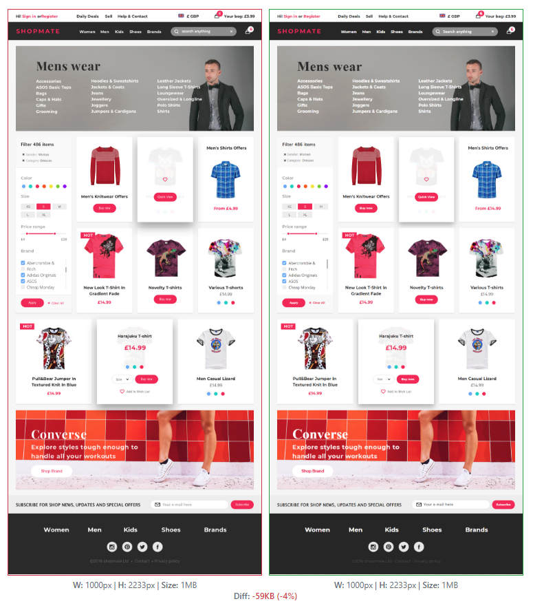
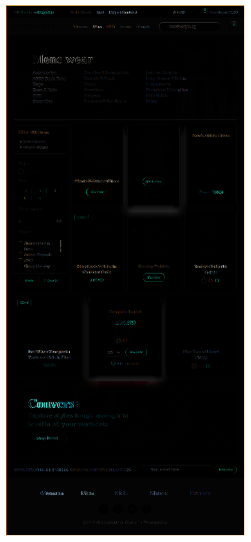

# UIUX Challenge

This is the pixel perfect HTML/CSS source for UIUX challenge.
https://app.zeplin.io/project/5c5334039c3e07307b1fbb96/screen/5c5745b80063923541dce1b9

### Flexbox Grid
This source used [Flexbox Grid](http://flexboxgrid.com/) as a grid system.
```html
<link rel="stylesheet" href="https://cdnjs.cloudflare.com/ajax/libs/flexboxgrid/6.3.1/flexboxgrid.min.css" type="text/css" >
```

### Zeplin
The sample page is designed with [Zeplin](https://zeplin.io). Here is the credentials for this one.
```
username: turingdeveloper@gmail.com
password: 111111
```

### Screenshots

Sample Page vs  Current Page



Difference


---
© 2019 [Turing, Inc.](https://turing.com)